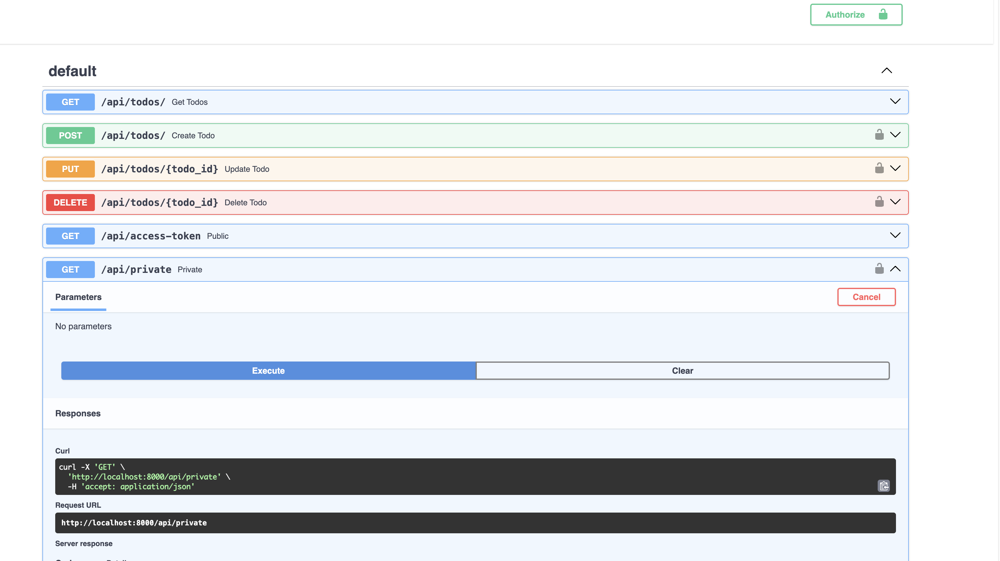

# Secure Todo List API

This project is a Secure Todo List API built with FastAPI, featuring token-based authentication for secure access to create, read, update, and delete (CRUD) operations on todo items.



## Features

- **CRUD Operations**: Supports creating, reading, updating, and deleting todo items.
- **Token-Based Authentication**: Utilizes custom token-based authentication to secure endpoints.
- **In-Memory Database**: Uses a simulated database list for storing todo items, demonstrating the API's functionality without external database dependencies.

## Installation

Ensure you have Python 3.6 or later installed on your machine. Follow these steps to set up the project:

```bash
git clone https://github.com/indamutsa/SEC_FastAPI_Auth0_Integration.git
cd SEC_FastAPI_Auth0_Integration
```

## Prerequisites

- Python 3.8 or later
- Auth0 account | within the account, get the secret, client_id, and domain
- Create .env add your Auth0 credentials

```plaintext
AUTH0_DOMAIN=your_auth0_domain
AUTH0_API_AUDIENCE=https://fastapiexample.com
AUTH0_ISSUER=https://your_auth0_domain
AUTH0_ALGORITHMS=RS256
CLIENT_ID=your_client_id
CLIENT_SECRET=your_client_secret
```

The project structure should look like this:

```plaintext
❯ tree -L 2 .
.
├── Readme.md
├── application
│   ├── __pycache__
│   ├── config.py
│   ├── main.py
│   ├── models.py
│   └── utils.py
├── pyenv
│   ├── bin
│   ├── lib
│   └── pyvenv.cfg
├── requirements.txt
├── test
│   └── test_main.py
└── venv
    ├── bin
    ├── lib
    └── pyvenv.cfg

10 directories, 9 files
```

### Setting Up a Working Container

Refer to the [working-container.md](../working-container.md) guide to initialize your Docker container environment. This setup ensures that no direct installations are required on your local machine, except for Docker.

### Preparing the Environment

It's recommended to use a virtual environment for Python projects. Create and activate one using:

```bash
python3 -m venv venv
source venv/bin/activate
```

After activating the virtual environment, install the project dependencies:

```bash
pip install -r requirements.txt
```

## Usage

Start the FastAPI server with the following command:

```sh
uvicorn application.main:app --reload
```

This will start the server on `http://localhost:8000`. You can interact with the API using a tool like cURL, Postman, or visit `http://localhost:8000/docs` for the Swagger UI documentation provided by FastAPI.

### Accessing the API

- **Get Access Token**: First, obtain an access token from `/api/access-token`.
- **Public Endpoint**: Access the public endpoint at `/api/access-token`.
- **Private Endpoint**: Access the private, authenticated endpoints by including the token in your request headers.

## Endpoints

- **GET `/api/todos/`**: Fetch all todo items.
- **POST `/api/todos/`**: Create a new todo item. Requires authentication.
- **PUT `/api/todos/{todo_id}`**: Update an existing todo item by id. Requires authentication.
- **DELETE `/api/todos/{todo_id}`**: Delete a todo item by id. Requires authentication.
- **GET `/api/access-token`**: Get an access token for testing secured endpoints.
- **GET `/api/private`**: A private endpoint requiring token authentication.

### Test the server by visiting the following URLs:

```sh
curl -X 'GET' \
  --url <http://127.0.0.1:8000/api/public>
```

```json
{
  "status": "success",
  "msg": "Hello from a public endpoint! You don't need to be authenticated to see this."
}
```

The private endpoint requires authentication. To test it, run the following command:

```sh
curl -X 'GET' \
  --url '<http://127.0.0.1:8000/api/private>'
    # {"detail": "Not authenticated"}
```

The following should go through since it only needs any header:

```sh
curl -X 'GET' \
  --url '<http://127.0.0.1:8000/api/private>' \\
  --header 'Authorization: Bearer FastAPI is awesome'
```

But this is not right, we should be able to reject requests that do not have a valid token. We will use Auth0 to secure the server.

Set Up an Auth0 API

Before you begin protecting endpoints in your API you’ll need to create an API on the Auth0 Dashboard. If you haven't an Auth0 account, you can sign up for a free one. Then, go to the APIs section and click on Create API.

This will open a new window for configuring the API. Set the following fields in that window:

- Name, a friendly name or description for the API. Enter Fast API Example for this sample.
- Identifier, which is an identifier that the client application uses to request access tokens for the API. Enter the string `https://fastapiexample.com`. This identifier is also known as audience.
- Signing Algorithm, leave the default setting, `RS256`.

After entering those values, click the Create button.

## Configure JSON Web Token (JWT) Validation

The verify method consists of three steps to validate the integrity of the token:

The code snippet below describes the steps involved in validating a JSON Web Token (JWT):

1. It retrieves the token from the Authorization header.
2. The method uses the key ID (kid claim present in the token header) to obtain the key from the JWKS (JSON Web Key Set) for verifying the token signature. If this step encounters any errors, it returns an error message.
3. Next, the method attempts to decode the JWT using the gathered information. If there are any errors, it returns an error message. If successful, it returns the token payload.

All done! You are ready now to start securing your endpoints.
